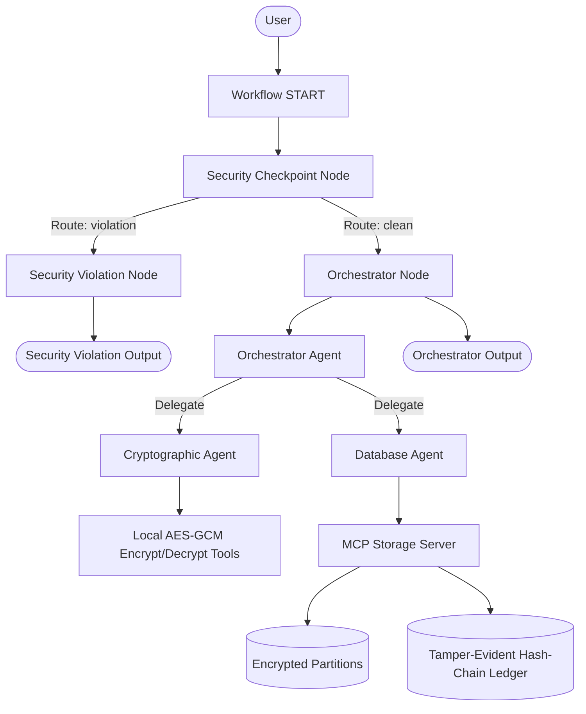
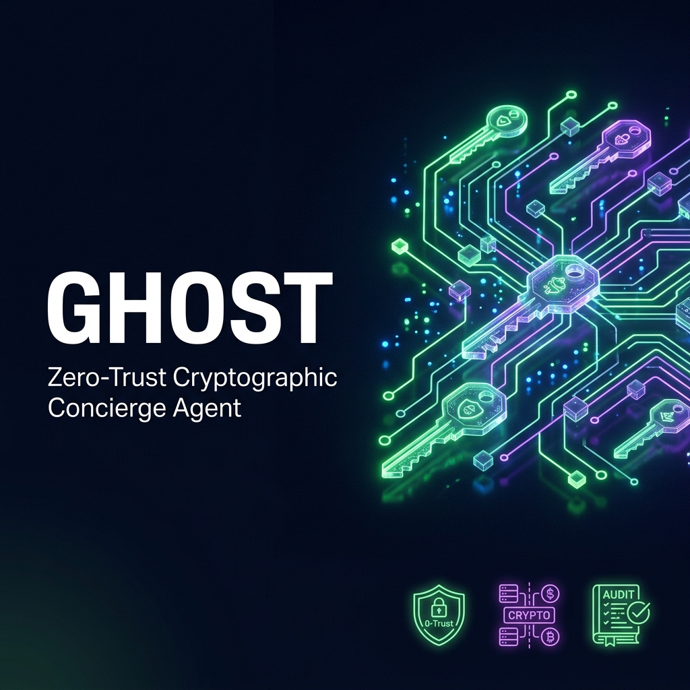
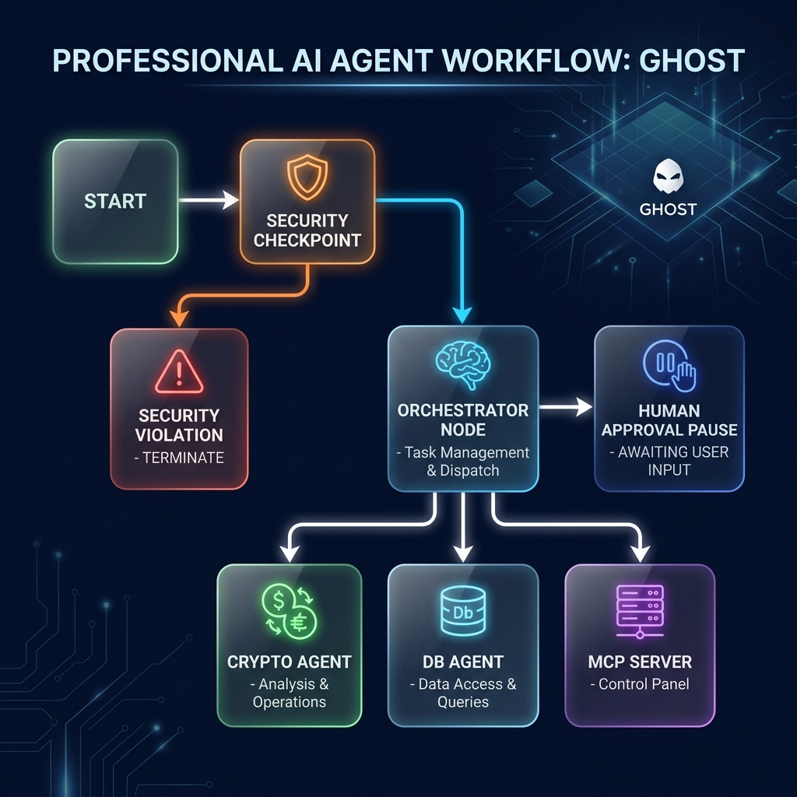

# Ghost: Zero-Trust Cryptographic Concierge Agent

Ghost is a security-focused personal assistant built for the **AI Agents: Intensive Vibe Coding Capstone Project**. 

In standard multi-agent setups, a central agent coordinates all user tasks and holds full access to all underlying databases. If that coordinator is compromised, the entire database is exposed. **Ghost addresses this security vulnerability by using cryptographic data partitioning and a tamper-evident audit ledger.**

---

## 🔒 Security Architecture

Ghost implements a three-tier agent framework integrated with a secure local storage server and a sentinel node:



---

## 📋 Prerequisites

Before running the project, make sure you have:
- **Python 3.11 or higher** installed.
- **uv**: Fast Python package manager ([Install Guide](https://docs.astral.sh/uv/getting-started/installation/)).
- **Gemini API Key**: Obtain a developer API key from [Google AI Studio](https://aistudio.google.com/apikey).

---

## 🚀 Quick Start

1. Clone this repository (replace with your actual repository URL):
   ```bash
   git clone <repo-url>
   cd ghost
   ```

2. Set up your environment variables:
   ```bash
   cp .env.example .env   # or edit the existing .env file
   ```
   Add your `GOOGLE_API_KEY` to the `.env` file:
   ```
   GOOGLE_API_KEY=your_gemini_api_key_here
   GOOGLE_GENAI_USE_VERTEXAI=False
   GEMINI_MODEL=gemini-2.5-flash
   ```

3. Install the required dependencies:
   ```bash
   make install
   ```

4. Launch the ADK Web Playground (UI):
   - **macOS / Linux**:
     ```bash
     make playground
     ```
   - **Windows**:
     ```powershell
     uv run adk web app --host 127.0.0.1 --port 18081 --reload_agents
     ```
   - Open your browser to: [http://localhost:18081](http://localhost:18081)

---

## 🛠️ How to Run & Verify

- **Interactive Playground (Web UI)**:
  ```bash
  make playground
  ```
  *(Launches the playground on port `18081`)*
  
- **FastAPI Backend Service**:
  ```bash
  make run
  ```
  *(Launches the FastAPI backend on port `8090`)*

- **Running Tests**:
  ```bash
  make test
  ```

---

## 🎯 Sample Test Cases

Test the agent in the Playground UI with these three domain-specific scenarios:

### Test Case 1: Secure Credential Storage
* **Input (Message)**: 
  `Store the password "SuperSecret123!" for service "Github".`
* **Expected Flow**:
  1. The workflow starts, and the `security_checkpoint` validates that there is no prompt injection.
  2. The workflow pauses and triggers a **Human-in-the-Loop** prompt asking for your `master_password` (type `my-master-pass` in the UI popup).
  3. The `orchestrator` receives the password, routes the plain text to the `crypto_agent` for AES-GCM encryption.
  4. The `orchestrator` delegates to the `db_agent`, which calls the MCP tool to write the partition `Github` and append an entry to `ledger.json`.
* **Expected Output**: Confirmation that the partition "Github" was successfully encrypted and stored, with a corresponding hash-chained ledger block appended.

### Test Case 2: Secure Credential Retrieval
* **Input (Message)**: 
  `Retrieve the credentials for "Github".`
* **Expected Flow**:
  1. The `security_checkpoint` verifies the request is safe.
  2. The workflow unlocks using your master password (if already provided, it bypasses the prompt).
  3. The `orchestrator` delegates to the `db_agent` to fetch the partition for `Github`.
  4. The `orchestrator` routes the encrypted ciphertext, salt, and nonce to the `crypto_agent` to decrypt using the master password.
* **Expected Output**: The decrypted plaintext credential `"SuperSecret123!"` is presented.

### Test Case 3: Audit Ledger Verification
* **Input (Message)**: 
  `Verify the database audit ledger integrity.`
* **Expected Flow**:
  1. The `security_checkpoint` runs clean.
  2. The `orchestrator` delegates to the `db_agent` to check the ledger file.
  3. The `db_agent` calls the MCP tool `verify_ledger_integrity`, which checks that all SHA-256 links between blocks are intact and matches.
* **Expected Output**: A validation message verifying that the ledger is 100% intact and reporting the total number of audited operations.

---

## 🔍 Troubleshooting

1. **Uvicorn fails to start / Address already in use (18081 or 8090)**
   - *Cause*: A previous process is still running in the background.
   - *Fix (Windows)*: Run this command in PowerShell:
     ```powershell
     Get-Process -Id (Get-NetTCPConnection -LocalPort 18081, 8090 -ErrorAction SilentlyContinue).OwningProcess | Stop-Process -Force
     ```
   - *Fix (macOS/Linux)*:
     ```bash
     lsof -ti:18081,8090 | xargs kill -9
     ```

2. **Decryption Failed error**
   - *Cause*: The master password entered during retrieval does not match the one used to encrypt the credentials, causing the AESGCM decryption key derivation to produce an incorrect key.
   - *Fix*: Re-enter the correct master password or reset the vault database.

3. **MCP Server Connection Failure**
   - *Cause*: The command command or absolute path for the MCP server script in `agent.py` failed to execute.
   - *Fix*: Ensure `uv` is installed and on your system PATH, and verify you are executing from the correct `ghost` project folder.

---

## 🎨 Assets

The following visual assets depict the project cover page and the internal multi-agent workflow:

### Project Cover Page


### Agent Workflow Architecture


---

## 🎬 Demo Script

A pre-written spoken demo script is available to guide you through presenting the capstone project:
- View the script here: [DEMO_SCRIPT.txt](DEMO_SCRIPT.txt)

---

## Push to GitHub

1. Create a new repo at https://github.com/new
   - Name: ghost
   - Visibility: Public or Private
   - Do NOT initialize with README (you already have one)

2. In your terminal, navigate into your project folder:
   ```bash
   cd ghost
   git init
   git add .
   git commit -m "Initial commit: ghost ADK agent"
   git branch -M main
   git remote add origin https://github.com/<your-username>/ghost.git
   git push -u origin main
   ```

3. Verify .gitignore includes:
   ```
   .env          ← your API key — must NEVER be pushed
   .venv/
   __pycache__/
   *.pyc
   .adk/
   ```

⚠ NEVER push `.env` to GitHub. Your API key will be exposed publicly.
