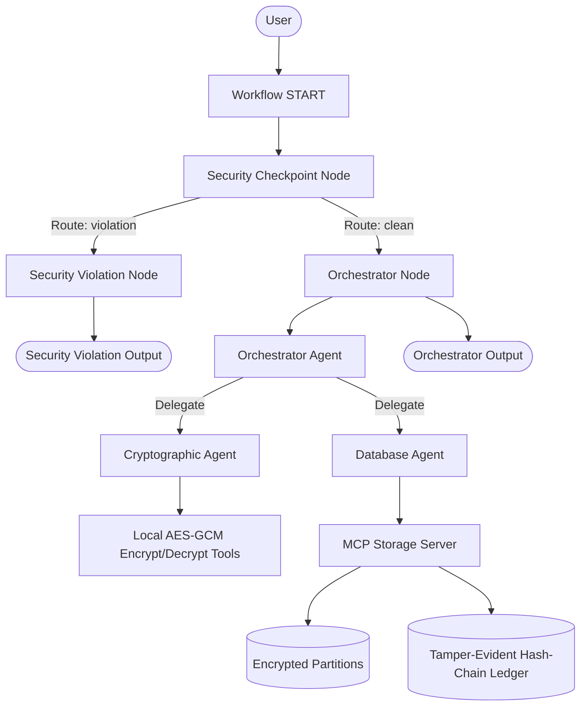

# Ghost: Zero-Trust Cryptographic Concierge Agent — Submission Write-Up

This document serves as the project write-up for the **AI Agents: Intensive Vibe Coding Capstone Project**.

---

## 🚨 Problem Statement

In typical multi-agent architectures, a central orchestrator acts as the single point of entry and coordination. This coordinator usually has direct read/write access to all application databases. If this central agent is compromised (e.g., via prompt injection, malicious tool configuration, or a model vulnerability), the attacker gains access to the coordinator's credentials and can dump or modify the entire database. 

**Ghost** addresses this critical vulnerability by introducing **Zero-Trust Cryptographic Partitioning** and a **Tamper-Evident Audit Ledger**. In Ghost:
1. The orchestrator never sees or stores plain-text secrets.
2. Cryptographic keys are derived dynamically from a user-supplied master password and never stored in the database.
3. Every operation is cryptographically signed and chained in a tamper-evident hash ledger, making any unauthorized data manipulation visible immediately.

---

## 🏛️ Solution Architecture

Ghost uses the ADK 2.0 Graph Workflow API to route execution through a dedicated safety pipeline:

---

## ⚙️ Concepts Used (with File References)

1. **ADK Workflow Graph API (ADK 2.0)**:
   - Defined in [agent.py](app/agent.py#L225-L238). It handles the flow from `START` through the `security_checkpoint` and routes to either `security_violation` or `orchestrator_node`.
2. **Specialized LlmAgent**:
   - `orchestrator_agent`, `crypto_agent`, and `db_agent` are defined as specialized agents with distinct instructions in [agent.py](app/agent.py#L96-L177).
3. **AgentTool Delegation**:
   - The orchestrator agent delegates subtasks using `AgentTool(crypto_agent)` and `AgentTool(db_agent)` defined in [agent.py](app/agent.py#L173-L174).
4. **MCP Server (Model Context Protocol)**:
   - Built inside [mcp_server.py](app/mcp_server.py) using the FastMCP SDK. It is wired into the `db_agent` and `crypto_agent` using `McpToolset` in [agent.py](app/agent.py#L82-L92).
5. **Security Checkpoint**:
   - A workflow function node defined in [agent.py](app/agent.py#L183-L257) that performs input validation, PII scrubbing, injection checks, and writes to an audit ledger.
6. **Agents CLI**:
   - Scaffolding, dependency pinning in `pyproject.toml`, and runtime commands generated with `agents-cli`.

---

## 🛡️ Security Design

* **Zero-Trust Storage**: Data is encrypted using AES-GCM-256 before leaving the cryptographic agent. The database agent and storage server only see encrypted blobs (ciphertext), salts, and nonces. They never have access to the master key or plain text.
* **Key Derivation**: Keys are derived on-demand using PBKDF2HMAC (SHA-256) with 100,000 iterations and a random salt. Key material is kept in memory only during the active invocation and is never written to disk.
* **Tamper-Evident Audit Ledger**: Every store or read operation is logged to `ledger.json` as a linked block. Each block contains a SHA-256 hash that links to the previous block's hash. If an attacker edits a password file or modifies a ledger entry, the ledger verification tool detects a hash mismatch or broken chain instantly.
* **PII Sentinel & Injection Filter**: The `security_checkpoint` runs regex filters to redact Credit Cards and SSNs, and keyword matching to identify prompt injection attacks, routing malicious queries to a safe block node.

---

## 🗄️ MCP Server Design

The MCP server in `mcp_server.py` implements stdio transport and exposes five tools:
1. `write_partition`: Writes a JSON file containing the encrypted ciphertext, salt, and nonce.
2. `read_partition`: Reads the JSON file for a given partition ID.
3. `append_ledger_entry`: Generates a cryptographically linked ledger block.
4. `verify_ledger_integrity`: Validates the ledger's hash chain and reports any changes or tampering.
5. `reset_ledger`: Wipes partitions and starts a new ledger with a genesis block.

---

## ✋ Human-in-the-Loop (HITL) Flow

A session's master password is required to encrypt or decrypt passwords. Rather than storing this password, the workflow uses ADK's `RequestInput` mechanism. 

Inside the `orchestrator_node` in [agent.py](app/agent.py#L225-L238), if `master_password` is not present in `ctx.state`, the node yields `RequestInput(interrupt_id="master_password")`. The runner pauses execution, alerts the UI/user to input the master password, and resumes execution once provided. This guarantees that cryptographic vault operations are always explicitly authorized by a human session key.

---

## 🎬 Demo Walkthrough

1. **Vault Initialization**: The user runs `Reset the vault` which calls `reset_ledger` and sets up the genesis block.
2. **Credential Storage**: The user inputs `Store the secret note "Key to the city is 42" under partition "city-key"`. The system prompts for a master password, encrypts the note, and appends block #1 to the ledger.
3. **Ledger Auditing**: The user asks `Verify the ledger`. The database agent runs the validation and confirms the integrity of the ledger.
4. **Unauthorized Tampering Test**: If a third party manually modifies `ledger.json` (e.g., changes a hash) or updates a partition file, running `Verify the ledger` will output:
   `CRITICAL: Hash mismatch at block #1! Block has been tampered with.`

---

## 📈 Impact / Value Statement

Ghost demonstrates how multi-agent architectures can be constructed securely without sacrificing autonomous capability. By isolating database access to a specialized, cryptographically blind database agent and verifying operations against a tamper-evident audit log, organizations can deploy AI assistants that handle sensitive corporate or personal data with high security guarantees.
